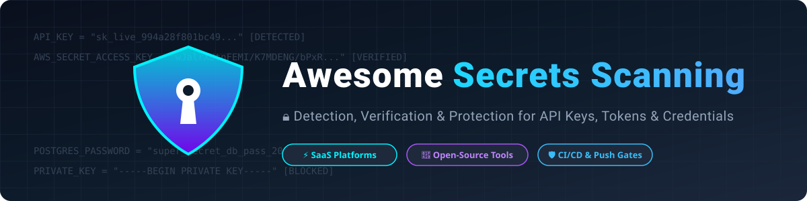

# 🛡️ Awesome Secrets Scanning 🔑

  
  
  
  
  
  

### 🔍 Top Secrets Scanning & Leak Prevention Tools Ecosystem

**A Curated List of SaaS Platforms & Open-Source Tools for Hardcoded Secret Detection, API Key Verification & Credential Leak Prevention**

*Detect API keys, passwords, OAuth tokens, certificates & sensitive credentials across Git history, CI/CD pipelines, and cloud environments.*

**📅 Last updated: August 2026**

---

## 📌 Overview & Scope

Accidentally committing credentials to source control is one of the most critical security risks facing modern application development. This repository provides a comprehensive directory of both **enterprise SaaS platforms** and **community-driven open-source projects** specialized in **Secret Detection**, **Push Protection**, **Credential Verification**, and **Remediation Workflows**.

---

## 📑 Table of Contents

- [🏢 SaaS & Hosted Commercial Platforms](#-saas--hosted-commercial-platforms)
- [🐙 Open-Source GitHub Projects](#-open-source-github-projects)
- [💡 Strategy & Best Practices](#-strategy--best-practices)
- [🤝 How to Contribute](#-how-to-contribute)
- [⚠️ Disclaimer](#%EF%B8%8F-disclaimer)
- [⭐ Star History](#-star-history)

---

## 🏢 SaaS & Hosted Commercial Platforms

*Commercial secrets detection, Application Security Posture Management (ASPM), and enterprise remediation platforms sorted by company market cap / enterprise valuation (descending).*

| Product | Description | Valuation / Company Scale 📈 | Pricing (Starting Paid Tier) 💳 | Free Tier / Trial Limits 🎁 |
| :--- | :--- | :--- | :--- | :--- |
| **[SentinelOne PingSafe](https://www.sentinelone.com/)** | Enterprise Cloud-Native Application Protection Platform (CNAPP) with real-time secret detection and cloud risk management. | **~$7.5 Billion** (Public Market Cap: NYSE S) | **Custom / Quote-based** (licensed per cloud workload/asset) | **30-day free trial** / POC available upon sales request. |
| **[Check Point SpectralOps](https://spectralops.io/)** | Developer-first code security and secret scanner integrated into Check Point CloudGuard enterprise security suite. | **~$12.0 Billion** (Parent Market Cap: CHKP; Spectral acquired for ~$60M) | **Custom / Quote-based** (integrated in CloudGuard) | **Free forever** for up to 10 contributors & 10 repos; **14-day free trial**. |
| **[GitHub Secret Scanning](https://docs.github.com/en/code-security/secret-scanning)** | Native GitHub platform secret scanner with push protection, secret pattern alerts, and automatic partner revocation. | **~$7.5 Billion** (Part of Microsoft / GitHub division) | **$19/active committer/month** for private repos | **Free forever** for all public repositories with unlimited scanning & push protection. |
| **[Checkmarx Secrets](https://checkmarx.com/)** | Enterprise AST & ASPM platform scanning code, infrastructure, and CI/CD pipelines for exposed credentials. | **~$1.15 Billion** (H&F Private Equity Acquisition) | **Custom / Quote-based** (billed per developer seat) | **14-day evaluation license** available upon request via demo. |
| **[GitLab Secret Detection](https://docs.gitlab.com/ee/user/application_security/secret_detection/)** | Integrated GitLab DevSecOps security feature scanning code, merge requests, and pipelines for leaked secrets. | **~$800 Million** (GitLab Enterprise DevSecOps Division) | **$29/user/month** (Premium) / **$99/user/month** (Ultimate) | **Free forever** for basic pipeline scanning & JSON report artifacts; **30-day free trial**. |
| **[Apiiro](https://apiiro.com/)** | Deep code analysis & ASPM platform identifying hardcoded secrets, supply chain risks, and architecture flaws. | **~$500 Million** (Raised $140M total VC funding) | **Custom / Quote-based** (annual contract with 50-user minimum order quantity) | **14-day free trial** with no credit card required; free initial Software Risk Assessment. |
| **[GitGuardian](https://www.gitguardian.com/)** | Category-leading secrets detection & remediation engine monitoring public/private repos with real-time alerts & key verification. | **~$250 Million** (Raised $108M+ total VC funding) | **Custom / Quote-based** (contact sales for >25 devs) | **Free forever** for up to 25 contributing developers, 500 historical detections & 10k API calls/mo. |
| **[Cycode](https://cycode.com/)** | Complete ASPM platform offering secret detection, source code leak prevention, and software supply chain protection. | **~$200 Million** (Raised $80.6M total VC funding) | **Custom / Quote-based** (billed annually per active developer) | **14-day free trial** for platform evaluation; free open-source tools via Cygives. |
| **[TruffleHog Enterprise](https://trufflesecurity.com/)** | Enterprise version of TruffleHog with centralized dashboards, live credential verification, and non-Git data source scanning. | **~$100 Million** (Raised $39M+ total VC funding) | **Custom / Quote-based** (enterprise licensing per monitored developer) | **Free forever** for open-source CLI; **14-day demo/POC trial** available for Enterprise. |
| **[Gitleaks Commercial](https://gitleaks.io/)** | Commercial offerings and organization CI key licensing for the high-speed Gitleaks secret detection engine. | **Bootstrap / Commercial** (Maintainer-backed commercial licensing) | **Custom / Quote-based** (commercial support & org licenses) | **Free forever** for open-source CLI scanner (MIT); free license key for org CI/CD integrations. |

---

## 🐙 Open-Source GitHub Projects

*Active, community-maintained secret scanners and CLI tools sorted by GitHub star count (descending).*

- **[Trivy (secrets module)](https://github.com/aquasecurity/trivy)**   
  ⚡ *Comprehensive security scanner including secret detection alongside vulnerabilities, misconfigurations, and SBOM scanning for containers, filesystems, and Git repos.* **Apache-2.0**

- **[Gitleaks](https://github.com/gitleaks/gitleaks)**   
  ⚡ *Fast, lightweight secret scanner focused on Git repositories, files, and pre-commit hooks with ultra-fast execution speed and high rule coverage.* **MIT**

- **[TruffleHog](https://github.com/trufflesecurity/trufflehog)**   
  ⚡ *Powerful secret scanner with 800+ detectors and live credential verification across Git history, filesystems, S3, Docker, Slack, and Jira.* **AGPL-3.0**

- **[Semgrep (secrets rules)](https://github.com/semgrep/semgrep)**   
  ⚡ *Lightweight, fast static analysis engine with semantic pattern matching for secrets, vulnerabilities, and code quality in 30+ languages.* **LGPL-2.1**

- **[git-secrets](https://github.com/awslabs/git-secrets)**   
  ⚡ *AWS Labs tool preventing credential commits by installing Git hooks and scanning commits for AWS key patterns and secrets.* **Apache-2.0**

- **[Checkov](https://github.com/bridgecrewio/checkov)**   
  ⚡ *Static code analysis tool for Infrastructure as Code (IaC) that scans Terraform, CloudFormation, and Kubernetes files for secrets and misconfigurations.* **Apache-2.0**

- **[detect-secrets](https://github.com/Yelp/detect-secrets)**   
  ⚡ *Yelp’s enterprise secret detection tool using baseline tracking to prevent new secrets while managing legacy findings.* **Apache-2.0**

- **[shhgit](https://github.com/eth0izzle/shhgit)**   
  ⚡ *Real-time GitHub public commit stream scanner detecting secrets, API keys, and sensitive files committed across GitHub in real time.* **MIT**

- **[KICS (Keeping Infrastructure as Code Secure)](https://github.com/checkmarx/kics)**   
  ⚡ *Checkmarx open-source engine scanning Infrastructure-as-Code for hardcoded secrets, misconfigurations, and compliance flaws.* **Apache-2.0**

- **[Nosey Parker](https://github.com/praetorian-inc/noseyparker)**   
  ⚡ *High-performance CLI secret scanner built in Rust for searching deep Git history, filesystems, and uncompressed artifacts.* **Apache-2.0**

- **[ggshield](https://github.com/GitGuardian/ggshield)**   
  ⚡ *Open-source CLI from GitGuardian for local pre-commit hooks and CI/CD secret scanning using the GitGuardian detection engine.* **MIT**

- **[secretlint](https://github.com/secretlint/secretlint)**   
  ⚡ *Pluggable linting tool for credentials and secrets supporting custom rule plugins and pre-commit checks.* **MIT**

- **[git-hound](https://github.com/tillson/git-hound)**   
  ⚡ *Reconnaissance secret scanner searching GitHub for sensitive files, API keys, and credentials using pattern matching and regex.* **MIT**

- **[whispers](https://github.com/Skyscanner/whispers)**   
  ⚡ *Static code analysis tool designed by Skyscanner to identify hardcoded credentials, API tokens, and secret patterns.* **MIT**

- **[secret-bridge](https://github.com/duo-labs/secret-bridge)**   
  ⚡ *Duo Labs tool for monitoring Git repositories and detecting credentials before they reach public visibility.* **BSD-3-Clause**

---

## 💡 Strategy & Best Practices

1. **Pre-Commit Push Protection:** Use **Gitleaks** or **ggshield** in pre-commit hooks to block secrets before commits enter version control.
2. **CI/CD Security Gates:** Integrate **TruffleHog**, **Trivy**, or **Semgrep** in pull requests to fail builds when hardcoded keys are introduced.
3. **Live Credential Verification:** Utilize **TruffleHog** or **GitGuardian** verification APIs to check if detected API keys are active.
4. **Baseline Management:** Implement **detect-secrets** baselines to manage legacy findings without breaking existing pipelines.
5. **Platform Automation:** Enable native **GitHub Secret Scanning** and **GitLab Secret Detection** for continuous organization-wide scanning.

---

## 🤝 How to Contribute

Contributions are welcome! Please follow these simple guidelines:

1. Fork the repository `https://github.com/ishandutta2007/Awesome-Secrets-Scanning`.
2. Add or update entries in `README.md` following the established tabular format (for SaaS) or badge format (for Open-Source).
3. Ensure open-source additions are inserted in **sorted order by star count (descending)**.
4. Submit a Pull Request with a descriptive title and summary of changes.

---

## ⚠️ Disclaimer

- This list is **community-curated** for educational,AppSec, and research purposes.
- Secret scanning tools reduce risk but do not replace developer education, secret managers (HashiCorp Vault, AWS Secrets Manager), and short-lived tokens.
- Never commit real credentials to test scanners; always use mock placeholders.

---

## ⭐️ Star History

<a href="https://www.star-history.com/?repos=ishandutta2007%2FAwesome-Secrets-Scanning&type=date&legend=bottom-right">
<picture>
<source media="(prefers-color-scheme: dark)" srcset="https://api.star-history.com/chart?repos=ishandutta2007/Awesome-Secrets-Scanning&type=date&theme=dark&legend=bottom-right" />
<source media="(prefers-color-scheme: light)" srcset="https://api.star-history.com/chart?repos=ishandutta2007/Awesome-Secrets-Scanning&type=date&legend=bottom-right" />

</picture>
</a>

---

**Made with ❤️ for AppSec Engineers, DevOps Teams, and Developers.**
